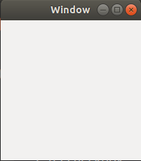
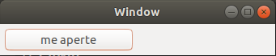
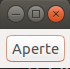
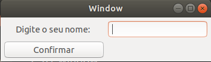
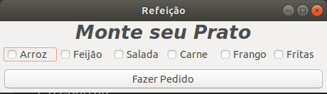
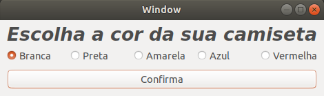
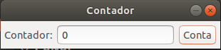

# GTK Exemplos 
Este repositório apresenta diversos exemplos de uso de GTK com Glade

## Dependências
Para executar esses exemplos é necessário a instalação de duas bibliotecas a libgtk-3-dev e a 
biblioteca glade.

```bash
$ sudo apt update
```

```bash
$ sudo apt install libgtk-3-dev
```

```bash
$ sudo apt-get install glade
```
## Compilação
Estes exemplos fazem uso do cmake. Para realizar a compilação acesse a pasta do projeto desejado, crie a pasta com o nome de build, acesse a pasta build e execute o comando do cmake para realizar a criação dos arquivos para a compilação. Ao término da geração compile o projeto. A seguir existe uma descrição com realizar os passos:

Acessar a pasta do projeto (Será usado o projeto 01-window para exemplificar)
```bash
$ cd 01-window
```
Criar a pasta build para armazenar todos os arquivos gerados pelo cmake
```bash
$ mkdir build
```
Acessar a pasta build
```bash
$ cd build
```

Executar o cmake para gerar os arquivos de compilação
```bash
$ cmake ..
```
Executar o make para compilar o projeto
```bash
$ make
```

## Execução do exemplo
Para executar a aplicação, após a compilação acessa a pasta bin e execute o programa

Acessando a pasta bin
```bash
$ cd bin
```
Executando a aplicação
```bash
$ ./application
```

## 01-window


Neste exemplo é apresentado a criação de uma tela que é usado como template para os demais
exemplos. 

## 02-button


Neste exemplo é apresentado o Widget GtkButton, como configurá-lo e como usar os seus eventos

## 03-dialog


Neste exemplo é apresentado o Widget GtkDialog, com esse Widget é possível criar as telas de popup

## 04-entry


Neste exemplo é apresentado o Widget GtkEntry, com esse componente é possível capturar informações via texto, e como usar os seus eventos

## 05-checkbox


Neste exemplo é apresentado o Widget GtkCheckBox, com esse componente é possível fazer multi-seleção de parâmetros.

## 06-radio_button


Neste exemplo é apresentado o Widget GtkRadioButton, diferente do GtkCheckBox, esse componente só pode haver um selecionado, para que isso seja respeitado conta com um recurso de group.

## 06-radio_button_gslist


Neste exemple o exemplo 06-radio_button é reimplementado com o uso do gslist que recupera a lista de todos os radio_buttons que pertencem a um grupo.

## 07-counter


Neste exemplo é implementado o projeto counter, que nada mais é do que um simples contador

## 08-counter_mvc


Neste exemplo o projeto counter é reimplementado usando o padrão MVC (model-view-controller)
